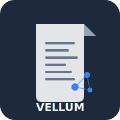

# Markdown Showcase

This document demonstrates every Markdown feature supported by Vellum. Use it as a reference for writing your own documents.

## Headings

Headings from level 1 through level 6 are supported:

# Heading 1
## Heading 2
### Heading 3
#### Heading 4
##### Heading 5
###### Heading 6

---

## Text formatting

Regular text, **bold text**, *italic text*, ***bold and italic***, ~~strikethrough~~, and ==highlighted text==.

You can also use `inline code` for short code references.

---

## Links

### Standard links

- [External link](https://example.com)
- [Link with title](https://example.com "Example Site")

### Wikilinks

Vellum supports Obsidian-style wikilinks for internal document linking:

- Simple link: [[index]]
- Link with display text: [[index|Back to home]]
- Link to another document: [[wikilinks-demo]]

All wikilinks are tracked and appear in the [[index|graph view]].

---

## Lists

### Unordered list

- First item
- Second item
  - Nested item A
  - Nested item B
    - Deeply nested
- Third item

### Ordered list

1. First step
2. Second step
   1. Sub-step A
   2. Sub-step B
3. Third step

### Task list

- [x] Set up Vellum backend
- [x] Configure authentication
- [x] Create vault structure
- [ ] Build graph view
- [ ] Add search functionality

---

## Blockquotes

> This is a blockquote. It can contain **formatted text** and even [[wikilinks-demo|links]].
>
> It can span multiple paragraphs.

### Nested blockquotes

> Outer quote
> > Inner quote
> > > Even deeper

---

## Callouts

Callouts (also known as admonitions) highlight important information.

### Note

> [!note]
> This is a note callout. Use it for supplementary information that's useful but not critical.

### Tip

> [!tip]
> This is a tip callout. Use it for helpful suggestions and best practices.

### Warning

> [!warning]
> This is a warning callout. Use it for potential issues or things to watch out for.

### Danger

> [!danger]
> This is a danger callout. Use it for critical information that could cause data loss or security issues.

### Info

> [!info]
> This is an info callout. Use it for general informational messages.

### Example

> [!example]
> This is an example callout. Use it to present illustrative examples.

### Abstract

> [!abstract]
> This is an abstract/summary callout. Use it for TL;DR sections or document summaries.

### Success

> [!success]
> This is a success callout. Use it to indicate completed or successful operations.

### Question

> [!question]
> This is a question callout. Use it for FAQ-style content or open questions.

### Bug

> [!bug]
> This is a bug callout. Use it to document known issues.

### Callout with custom title

> [!tip] Pro tip for power users
> You can customize the callout title by adding text after the type identifier.

---

## Code blocks

### Inline code

Use `backticks` for inline code. Reference variables like `user.roles` or commands like `docker compose up`.

### Fenced code blocks

#### Rust

```rust
use axum::{Router, routing::get, Json};
use serde::Serialize;

#[derive(Serialize)]
struct Health {
    status: String,
    uptime_seconds: u64,
}

async fn health_check() -> Json<Health> {
    Json(Health {
        status: "ok".to_string(),
        uptime_seconds: 3600,
    })
}

#[tokio::main]
async fn main() {
    let app = Router::new()
        .route("/health", get(health_check));

    let listener = tokio::net::TcpListener::bind("0.0.0.0:3000")
        .await
        .unwrap();
    axum::serve(listener, app).await.unwrap();
}
```

#### TypeScript

```typescript
interface User {
  sub: string;
  name: string;
  email: string;
  roles: string[];
}

async function fetchUser(): Promise<User> {
  const response = await fetch('/api/me', {
    credentials: 'include',
  });
  if (!response.ok) {
    throw new Error(`HTTP ${response.status}`);
  }
  return response.json();
}
```

#### Python

```python
from dataclasses import dataclass
from typing import Optional

@dataclass
class Document:
    path: str
    title: str
    content: str
    tags: list[str]
    last_modified: Optional[str] = None

    def matches_role(self, user_roles: list[str]) -> bool:
        if "*" in self.required_roles:
            return True
        return bool(set(user_roles) & set(self.required_roles))
```

#### SQL

```sql
SELECT
    d.path,
    d.title,
    d.last_modified,
    array_agg(t.name) AS tags
FROM documents d
LEFT JOIN document_tags dt ON d.id = dt.document_id
LEFT JOIN tags t ON dt.tag_id = t.id
WHERE d.vault_id = $1
GROUP BY d.id
ORDER BY d.last_modified DESC
LIMIT 50;
```

#### TOML

```toml
[access]
roles = ["dev", "admin"]

[access.paths]
"public/" = ["*"]
"internal/" = ["admin"]
```

#### Bash

```bash
#!/bin/bash
# Build and start all services
docker compose build --parallel
docker compose up -d

# Wait for backend health check
until curl -sf http://localhost:3000/api/health > /dev/null; do
    echo "Waiting for backend..."
    sleep 2
done

echo "Vellum is ready!"
```

#### JSON

```json
{
  "nodes": [
    { "id": "index.md", "label": "Welcome" },
    { "id": "features.md", "label": "Features" }
  ],
  "edges": [
    { "source": "index.md", "target": "features.md" }
  ]
}
```

#### YAML

```yaml
services:
  backend:
    build: ./backend
    ports:
      - "3000:3000"
    environment:
      - VELLUM__AUTH__MODE=oidc
    depends_on:
      - redis
```

#### CSS

```css
.callout {
  border-left: 4px solid var(--callout-color);
  padding: 1rem;
  margin: 1rem 0;
  border-radius: 0.25rem;
  background: var(--callout-bg);
}

.callout[data-type="warning"] {
  --callout-color: #f59e0b;
  --callout-bg: #fffbeb;
}
```

#### Svelte

```svelte
<script lang="ts">
  import type { FileNode } from '$lib/types';

  export let node: FileNode;
  export let depth = 0;

  let expanded = false;
</script>

{#if node.type === 'dir'}
  <button
    class="tree-node"
    style="padding-left: {depth * 1.5}rem"
    on:click={() => expanded = !expanded}
  >
    {expanded ? '▼' : '▶'} {node.name}
  </button>
  {#if expanded && node.children}
    {#each node.children as child}
      <svelte:self node={child} depth={depth + 1} />
    {/each}
  {/if}
{:else}
  <a href="/docs/{node.path}" class="tree-leaf" style="padding-left: {depth * 1.5}rem">
    {node.name}
  </a>
{/if}
```

---

## Tables

### Simple table

| Feature | Status | Notes |
|---------|--------|-------|
| Authentication | Done | OIDC with Keycloak |
| File tree | Done | Role-filtered |
| Document view | Done | Markdown to HTML |
| Graph view | In progress | Cytoscape.js |
| Search | In progress | Tantivy-based |

### Aligned columns

| Left aligned | Center aligned | Right aligned |
|:-------------|:--------------:|--------------:|
| Text | Text | Text |
| More text | More text | 1,234 |
| Even more | Even more | 56,789 |

---

## Images

Images can be referenced from the vault:



Images can also use external URLs or relative paths within the vault.

---

## Horizontal rules

Three or more dashes, asterisks, or underscores create a horizontal rule:

---

***

___

---

## Footnotes

Vellum supports footnotes for citations and side notes.

Here is a statement that needs a citation[^1]. And here is another[^2].

You can also use named footnotes[^named-note] for better readability in the source.

[^1]: This is the first footnote. It can contain **formatted text** and [links](https://example.com).

[^2]: This is the second footnote.

[^named-note]: Named footnotes work the same way but are easier to reference in the Markdown source.

---

## Inline tags

Vellum recognizes inline tags for categorization:

#markdown #demo #features #syntax #showcase

Tags are extracted from documents and can be used for filtering and organization.

---

## Highlights

Use double equals signs to ==highlight important text==. This is useful for drawing attention to ==key concepts== or ==critical information== within a paragraph.

---

## Embeds

Embed other documents inline using the `![[document-name]]` syntax:

![[wikilinks-demo]]

Embeds pull the content of the referenced document into the current view.

---

## Escaping

You can escape Markdown syntax with backslashes:

- \*not italic\*
- \*\*not bold\*\*
- \~~not strikethrough\~~
- \`not code\`
- \[[not a wikilink\]]

---

## HTML entities

Special characters: &amp; &lt; &gt; &quot; &copy; &mdash; &ndash;

---

## Combined features

Here's an example combining multiple features in a real-world context:

> [!tip] Quick reference
> When writing documents for Vellum, remember:
> - Use `[[wikilinks]]` to connect related documents
> - Add ==highlights== for key takeaways
> - Include frontmatter with `title` and `tags`
> - Use callouts for important notes
>
> See [[wikilinks-demo]] for linking examples.

---

This showcase covers all Markdown features supported by Vellum. For more information on how wikilinks work and how they build the document graph, see [[wikilinks-demo]].

#showcase #markdown #reference
